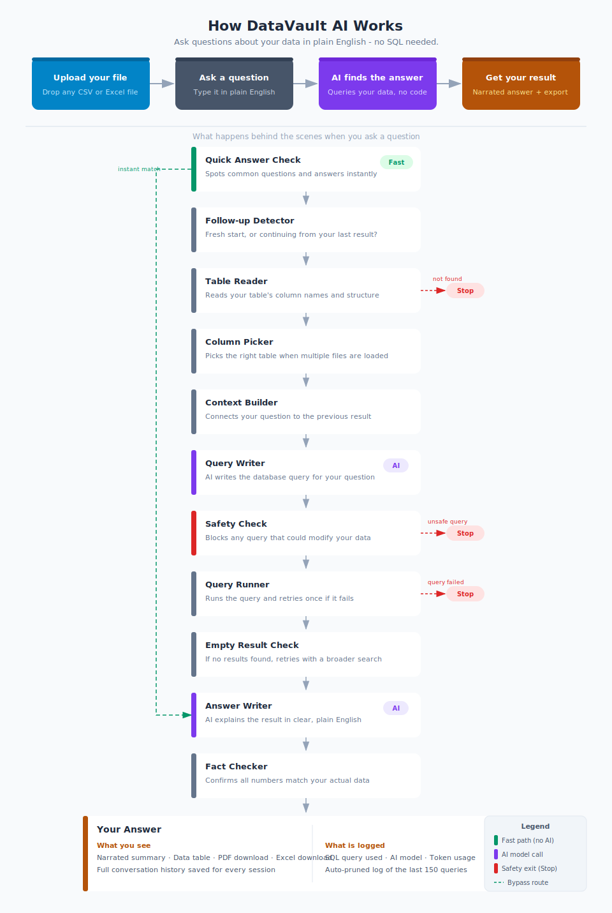

Most people have data but no way to talk to it. DataVault AI changes that - upload any CSV or Excel file, ask a question in plain English, and get a real answer backed by actual SQL. No formulas. No syntax. No guessing. Just your data, finally speaking your language

---

## Tech Stack

| Layer | Technology | Version | Purpose |
|---|---|---|---|
| **UI** | [NiceGUI](https://nicegui.io) | 3.10.0 | Web UI, file upload, chat interface, tabs, sidebar |
| **Database** | [DuckDB](https://duckdb.org) | >=0.10.0 | In-process SQL engine - runs SELECT on CSV/Excel data |
| **Chat History** | [SQLite](https://sqlite.org) | - | Persistent chat sessions via `core/chat_store.py` |
| **Pipeline** | [LangGraph](https://langchain-ai.github.io/langgraph/) | >=1.0.0 | StateGraph pipeline orchestration (nodes + conditional edges) |
| **LLM Gateway** | [OpenRouter](https://openrouter.ai) | API | Routes to multiple LLM providers via a single API key |
| **Primary LLM** | DeepSeek V3 (`deepseek/deepseek-chat`) | - | SQL generation (temp 0.0) + narration (temp 0.3) |
| **Fallback LLM 1** | Anthropic Claude 3.5 Haiku | - | Fallback if DeepSeek fails |
| **Fallback LLM 2** | OpenAI GPT-4o Mini | - | Second fallback if Haiku fails |
| **Data** | [pandas](https://pandas.pydata.org) | >=2.0.0 | DataFrame ops, fast-path dispatch, column statistics |
| **Excel I/O** | [openpyxl](https://openpyxl.readthedocs.io) | >=3.1.0 | Excel read (.xlsx/.xls) + Excel export |
| **PDF Export** | [fpdf2](https://py-pdf.github.io/fpdf2/) | >=2.7.0 | DataFrame to PDF bytes (landscape A4) |
| **HTTP Client** | [httpx](https://www.python-httpx.org) | >=0.27.0 | Raw HTTP calls to OpenRouter (no openai SDK) |
| **Config** | [python-dotenv](https://saurabh-kumar.com/python-dotenv/) | >=1.0.0 | `.env` loading via `dotenv_values()` |
| **Markdown** | [markdown2](https://github.com/trentm/python-markdown2) | >=2.4.0 | Renders LLM narration output in the UI |
| **SQL Parsing** | [sqlparse](https://github.com/andialbrecht/sqlparse) | >=0.5.0 | SQL formatting and parsing utilities |
| **Testing** | [pytest](https://pytest.org) | - | Smoke tests (8 tests, no API calls) |
| **Runtime** | Python | 3.10+ | TypedDict, union type hints, async/await |

---

## Quick Start

```bat
REM 1. Copy project to local folder
REM 2. Add your OpenRouter API key to .env
echo OPENROUTER_API_KEY=sk-or-v1-... > .env

REM 3. Run setup (creates venv, installs deps, runs smoke tests)
setup.bat

REM 4. Start the app
start_DataVault_AI.bat
REM   or manually:
REM   .venv\Scripts\activate && python app.py
```

Browser opens automatically at http://localhost:8080

> Get a free OpenRouter API key at [openrouter.ai/keys](https://openrouter.ai/keys).

---

## How It Works



<details>
<summary>View as text</summary>

```
Upload CSV/Excel
    -> Sanitize column names (spaces/slashes -> underscores, lowercased)
    -> Normalize date columns (DD/MM/YYYY -> YYYY-MM-DD at ingest)
    -> Write to single shared DuckDB file (data/datavault.duckdb)

User types a question
    -> QueryPipeline.run(question, db_path, active_table=...)
            [LangGraph nodes]
            fast_path           exact snippet match -> pandas result (skips SQL generation
                                and execution; narration LLM still runs)
            follow_up_detector  reads follow_up_enabled flag from UI toggle
                                ON + valid prev SQL -> cte_follow_up
                                OFF -> fresh query against full dataset
            schema_loader       DDL only (schema + types); filters to active_table only
            table_selector      single-table fast-path (no LLM call needed)
            cte_builder         wrap prev SQL as WITH prev_result AS (...)
            sql_generator       LLM call -> raw SQL (DuckDB dialect, single-table)
            validator           block destructive keywords
            executor            run SELECT -> DataFrame (retry once on error)
            empty_check         retry once with broader prompt if zero rows
            narrator            DataFrame -> structured markdown (LLM call)
            grounding           confirm narration numbers match the data

QueryResult(question, sql, df, narration, grounding, error, retried, is_follow_up)
    -> NiceGUI: narration card + SQL expansion + scrollable table + PDF/Excel buttons
```

</details>

---

## Key Features

### Persistent Chat History
Every conversation is saved to SQLite (`data/chat_history.db`). Previous chats appear
in the left sidebar on every restart. Click any chat to restore the full conversation
including narration, SQL, and data tables. Click X to delete a chat permanently.

### Multi-File Support
Upload multiple CSV or Excel files in one session. A file switcher dropdown appears at
the bottom of the input bar when more than one file is loaded. Each file is queried
independently in single-table mode - no cross-file JOINs are ever generated.

Switching files resets the follow-up context. To combine data from two files, merge
them into a single CSV first.

### Follow-Up Questions
A "Follow-up mode" switch sits in the input bar. When ON, each question scopes to the
previous result via a CTE:

```
Q1: "Show all incidents from 2023 with critical severity"
    -> follow-up OFF - fresh query against full table

Q2: "Which of those had the longest resolution time?"
    -> follow-up ON -> wraps Q1's SQL as WITH prev_result AS (...)
```

Turn follow-up OFF for percentage or aggregation questions after a grouped result -
the CTE only contains summary rows, not the raw data.

### Dataset Tab
Shows each loaded file as a card with row/column count, a data preview, and a delete
button. The Refresh icon re-scans the DuckDB file and rebuilds suggestions. The upload
icon opens the upload screen to add a new file.

### Suggestions Tab
AI-generated query suggestions based on your dataset's columns and types, loaded in
the background after each upload. Also shows editable snippet groups from
`prompt_snippets.json` - add and delete prompts that persist across restarts.

### Smart Clarification
Before running any query, the app checks if your question is too vague to produce
reliable results. If it is, it asks you one targeted clarifying question in the chat.
Once your intent is clear, the pipeline runs with the enriched question. Fails open -
if the check errors, your original question runs immediately.

### Upload Data Sanity Check
Immediately after every upload, 11 automated checks run against your data. Issues are
surfaced as warnings before you ask a single question - not buried in query errors.
Checks include: empty tables, high null rates, duplicate rows, numeric values stored
as text, unparseable date columns, future dates, and negative values in amount columns.

### Data Privacy
The LLM only receives table schema (column names and types) - no actual row data is
sent in the SQL generation prompt. Your data stays on your machine.

### PDF / Excel Export
Every query result with data has PDF and Excel download buttons. Exports run in a
background thread via `asyncio.to_thread()`.

---

## Project Structure

```
DataVault-AI/
|- app.py                    # NiceGUI entry point - full UI, handlers, state
|- config.py                 # All settings loaded from .env
|- prompt_snippets.json      # Saved snippet card prompts (3 groups)
|- requirements.txt
|- setup.bat                 # One-command venv + install + smoke test
|- start_DataVault_AI.bat    # Quick launch: python app.py
|- .env                      # API key (not committed)
|- core/
|   |- chat_store.py         # SQLite chat history (chats + messages tables)
|   |- query_pipeline.py     # Thin wrapper: builds state, invokes graph, returns QueryResult
|   |- graph_pipeline.py     # LangGraph StateGraph assembly and compilation
|   |- graph_state.py        # PipelineState TypedDict (shared by all nodes)
|   |- llm_client.py         # Raw HTTP client for OpenRouter (httpx, no openai SDK)
|   |- sql/
|   |   |- cte_utils.py          # merge_cte() - wraps prev SQL as named CTE
|   |   |- pandas_dispatch.py    # Direct pandas shortcuts for known prompts (no LLM)
|   |   |- sql_generator.py      # Prompt builder + SQL post-processor
|   |   |- sql_executor.py       # DuckDB runner + schema extractor
|   |   |- sql_validator.py      # Pre-exec safety + empty result detection
|   |   |- narrator.py           # DataFrame -> structured markdown via LLM
|   |   `- grounding_verifier.py # Narration number sanity check (2dp tolerance)
|   `- nodes/                # One file per LangGraph node
|       |- fast_path.py
|       |- follow_up_detector.py
|       |- schema_loader.py
|       |- table_selector.py
|       |- cte_builder.py
|       |- sql_generator.py
|       |- validator.py
|       |- executor.py
|       |- empty_check.py
|       |- narrator.py
|       `- grounding.py
|- export/
|   |- pdf_generator.py      # DataFrame -> PDF bytes (fpdf2, landscape A4)
|   `- excel_exporter.py     # DataFrame -> Excel bytes (openpyxl)
|- data/                     # Auto-created at startup (gitignored)
|   |- datavault.duckdb      # Single shared DuckDB file for all uploaded tables
|   `- chat_history.db       # SQLite chat history
`- tests/
    `- smoke_test.py         # 8 tests, no API calls required
```

---

## Configuration

All settings live in `config.py`, loaded from `.env` via `dotenv_values()`.

| Key | Default | Purpose |
|---|---|---|
| `OPENROUTER_API_KEY` | *(required)* | Set in `.env` file only |
| `LLM_TEMPERATURE` | `0.0` | Deterministic SQL output |
| `LLM_MAX_TOKENS` | `2048` | Max tokens per LLM call |
| `LLM_TIMEOUT_SECONDS` | `60` | Per-request HTTP timeout |

Models configured in `config.py`:
- `SQL_MODEL` - `deepseek/deepseek-chat`, temperature 0.0
- `NARRATION_MODEL` - `deepseek/deepseek-chat`, temperature 0.3
- Fallback chain: primary -> `anthropic/claude-3.5-haiku` -> `openai/gpt-4o-mini`

---

## API Costs

| Service | Role | Cost |
|---|---|---|
| OpenRouter | API gateway | Pay per token (small gateway fee) |
| DeepSeek V3 | Primary (SQL + narration) | ~$0.27 per million input tokens |
| Claude 3.5 Haiku | Fallback 1 | ~$0.80 per million input tokens |
| GPT-4o Mini | Fallback 2 | ~$0.15 per million input tokens |

For a local data analysis tool with normal usage, cost is typically fractions of a cent per query.

---

## Tests

```bat
python -m pytest tests/smoke_test.py -v
```

8 tests covering all core modules. No API calls, no files needed.

---

## Troubleshooting

### 401 "User not found" from OpenRouter
Run `python test_key.py`. A stale `setx` shell variable may be overriding `.env`.
```bat
setx OPENROUTER_API_KEY ""
```
`config.py` uses `dotenv_values()` which reads from file and ignores `os.environ`.

### Columns not found / wrong column names in SQL
Column names are sanitized on ingest: spaces and slashes become underscores, everything
is lowercased. Check the Dataset tab to see the actual column names.

### Empty results with no error
The pipeline retries once with a broader prompt automatically. Try rephrasing or check
the Dataset tab for exact column and value names.

### Date columns returning NULL or wrong groupings
Date columns are auto-normalized to `YYYY-MM-DD` at ingest if the column name matches
a temporal pattern (date, time, _at, created, updated, timestamp). Re-upload after
renaming the column if normalization was skipped.

### Wrong percentages with follow-up mode ON
Turn follow-up OFF. The CTE only contains the previous result's rows (summary-level),
not the raw data. Percentage calculations against grouped rows produce wrong values.

### Port 8080 already in use on restart
Kill the old process: open Task Manager, find the Python process, end it.
Or from terminal: `powershell -Command "Stop-Process -Id (netstat -ano | Select-String ':8080 .*LISTENING' | ForEach-Object { ($_ -split '\s+')[-1] }) -Force"`

### Chat history not showing after restart
The DB is at `data/chat_history.db` relative to the project folder. Always launch the
app from the project directory using `start_DataVault_AI.bat` or with the project folder as
the working directory. The Refresh icon in the header also re-loads the sidebar.

### Yellow warning banner - "Some numbers not found verbatim in data"
This is the grounding check. After the AI writes its answer, every number mentioned in
the text is verified against the actual values in the result table. The warning appears
when a number in the narration does not match any cell value in the data.

**This is non-blocking - your answer is not wrong.** Common reasons it triggers:

- The AI mentioned a row count ("27 rows") but row counts are not stored as cell values
- The AI derived a percentage mentally that does not appear as a column in the result
- The AI referenced a total from the full dataset while the result shows a filtered subset

**When to ignore it:** If the numbers in the data table below the answer look correct,
the warning is a false positive and can be disregarded.

**When to investigate:** If a specific number in the narration does not match what you
see in the table, the AI may have hallucinated that value - re-run the query or rephrase.
