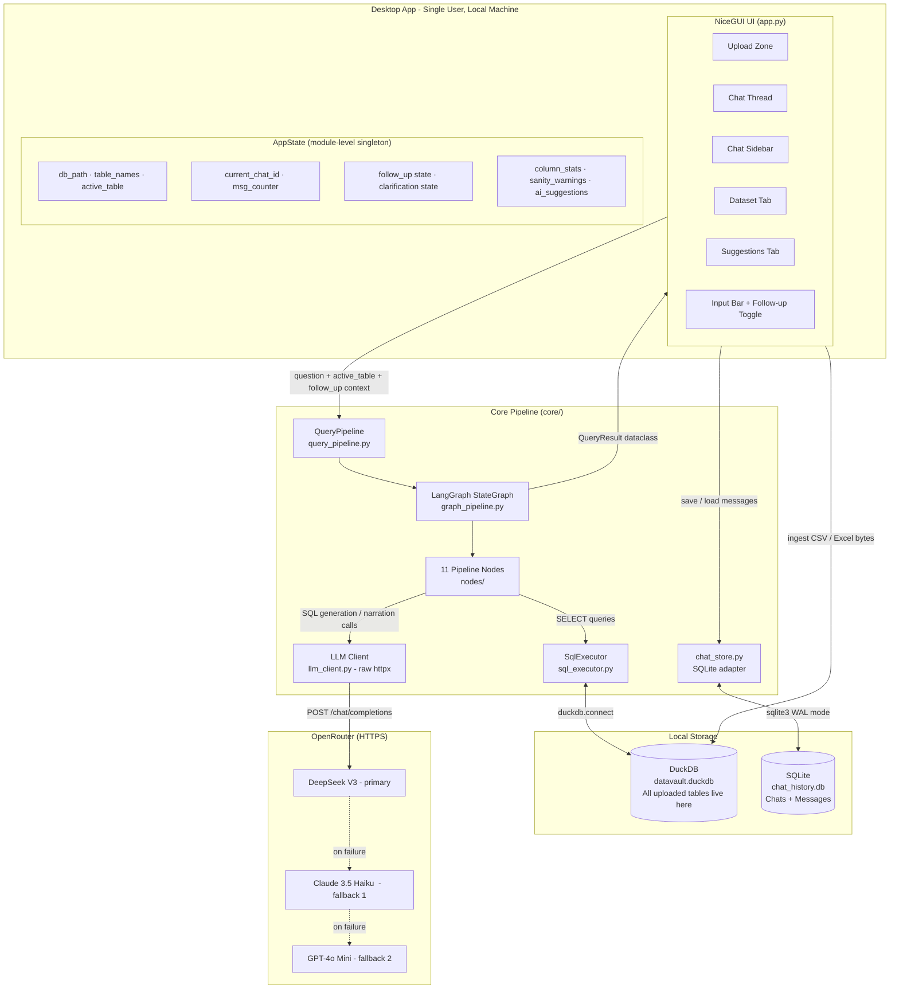
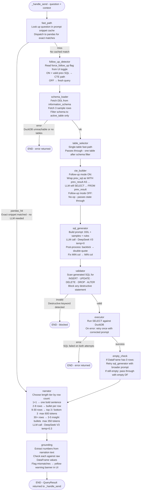
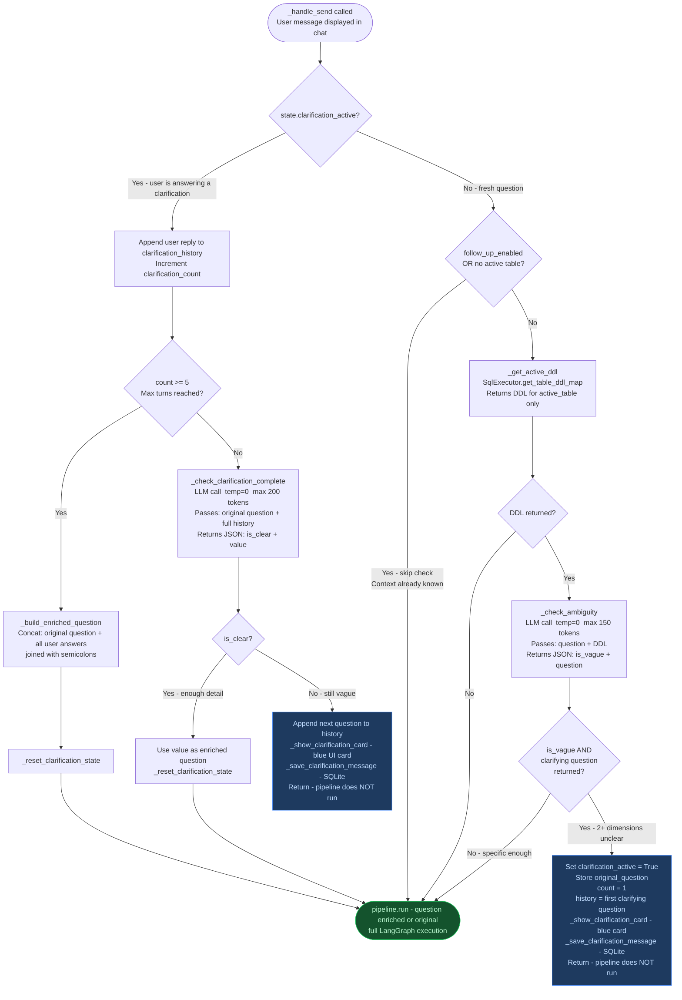
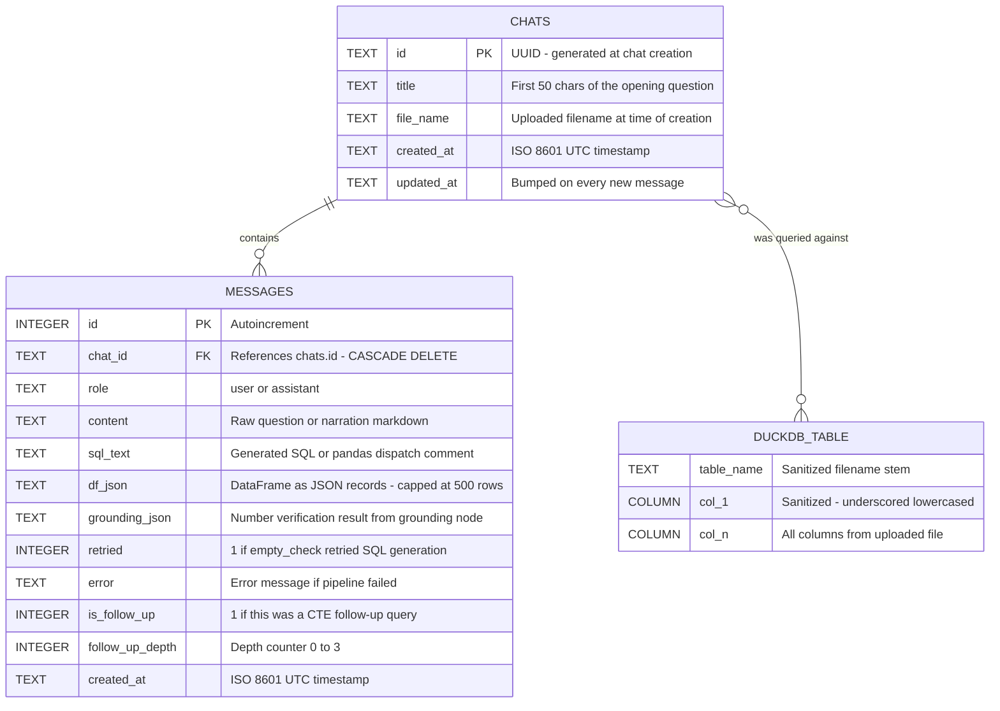
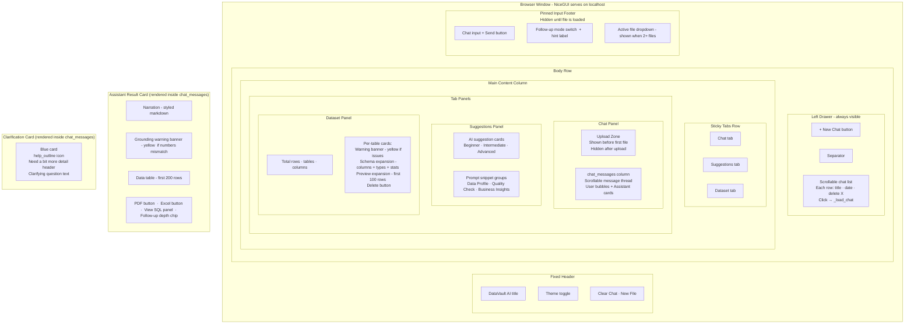
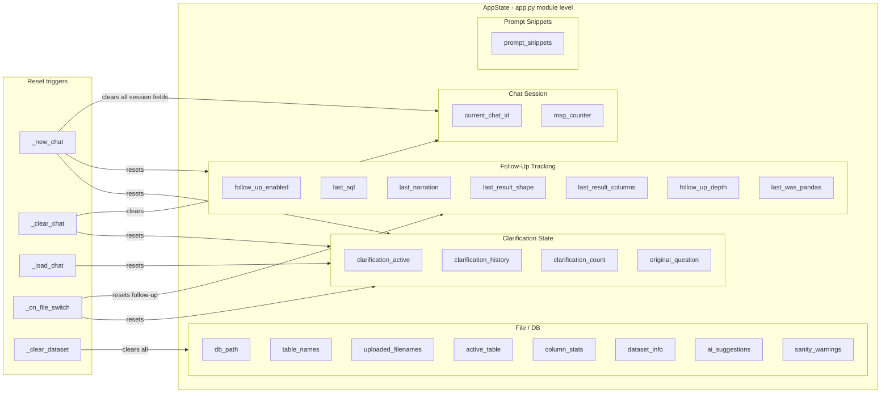

# DataVault AI - Architecture

Six diagrams covering the full system: component overview, upload pipeline, query pipeline, clarification flow, data layer, and UI layout.

---

## 1. System Architecture Overview

How the major components connect at runtime.

---

## 2. File Upload and Ingest Pipeline

Every step from file drop to DuckDB table, including the new sanity check.

```mermaid
flowchart TD
    A(["User drops CSV or Excel file"]) --> B{Excel file?}

    B -->|Yes| C{Multiple sheets?}
    C -->|Yes| BLOCK[/"Block - show sheet names in error toast\nUser must export a single sheet first"/]
    C -->|No| PARSE_XL["Parse single sheet with pd.ExcelFile"]

    B -->|No| PARSE_CSV["Read with pd.read_csv"]

    PARSE_XL --> SANITIZE
    PARSE_CSV --> SANITIZE

    SANITIZE["Sanitize column names\nspaces + slashes → underscores\nall lowercased"]

    SANITIZE --> NORM["_normalize_date_columns\nFor each column matching date · time · _at · created · updated · timestamp"]

    NORM --> DATE_CHECK{"dtype == object\nAND name matches\ntemporal pattern?"}

    DATE_CHECK -->|Yes| PARSE_DT["pd.to_datetime\nerrors=coerce  dayfirst=True"]
    PARSE_DT --> YEAR_GUARD{">50% parse OK\nAND >80% of years >= 1900?"}
    YEAR_GUARD -->|Yes| CONVERT["Format as YYYY-MM-DD string"]
    YEAR_GUARD -->|"No - e.g. day numbers 1-31\nwould become year 0001-0031"| LEAVE["Leave column as-is"]
    CONVERT --> NUMERIC
    LEAVE --> NUMERIC
    DATE_CHECK -->|No| NUMERIC

    NUMERIC["pd.to_numeric coercion\non remaining object columns"]

    NUMERIC --> DUCKDB_WRITE["CREATE OR REPLACE TABLE in DuckDB\nvia duckdb.register + SELECT *"]

    DUCKDB_WRITE --> STATS["compute_column_stats\nmin / max / avg for numeric\ndate range for date\ntype label for text"]

    STATS --> SANITY["run_data_sanity_check\n5 rule-based DuckDB queries"]

    SANITY --> W1{"0 rows?"}
    W1 -->|Yes| ERR_ROWS[/"Error: Table has 0 rows"/]
    W1 -->|No| W2{"< 5 rows?"}
    W2 -->|Yes| WARN_FEW["Warning: Only N rows"]
    W2 -->|No| W3
    WARN_FEW --> W3

    W3{"Any column\n> 80% null?"}
    W3 -->|Yes| WARN_NULL["Warning: X% null - per column"]
    W3 --> W4
    WARN_NULL --> W4

    W4{"Any column\n1 unique value?"}
    W4 -->|Yes| WARN_CONST["Warning: Only 1 unique value - per column"]
    W4 --> W5
    WARN_CONST --> W5

    W5{"Temporal column name\nbut stored as VARCHAR?"}
    W5 -->|Yes| WARN_DATE["Warning: dates could not be parsed"]
    W5 --> RESULT
    WARN_DATE --> RESULT

    RESULT{"Any warnings\ncollected?"}
    RESULT -->|Yes| AMBER[/"Amber toast - N notices\nYellow card in Dataset tab"/]
    RESULT -->|No| GREEN[/"Green success toast"/]

    AMBER --> ACTIVATE
    GREEN --> ACTIVATE

    ACTIVATE["Activate chat view\nRebuild Dataset + Suggestions tabs"]
    ACTIVATE --> BG["Fire AI suggestions generation\nin background asyncio task"]
```

---

## 3. LangGraph Query Pipeline

The 11-node StateGraph that processes every natural language question into a narrated result.

---

## 4. Multi-Turn Clarification Flow

How `_handle_send` intercepts a vague question before the pipeline runs.

---

## 5. Data Layer

SQLite schema for chat persistence and DuckDB for analytical queries.

**Storage locations:**

| Store | File | Purpose |
|---|---|---|
| SQLite | `data/chat_history.db` | Chat sessions, messages, DataFrames (≤500 rows) |
| DuckDB | `data/datavault.duckdb` | All uploaded tables - single shared file |

**SQLite maintenance:** `VACUUM` runs at startup and after each chat delete. WAL journal mode enabled for safe concurrent reads.

---

## 6. UI Component Layout

How NiceGUI constructs the full desktop window.

---

## AppState Field Map

All session state fields on the module-level `AppState` singleton, grouped by concern.

